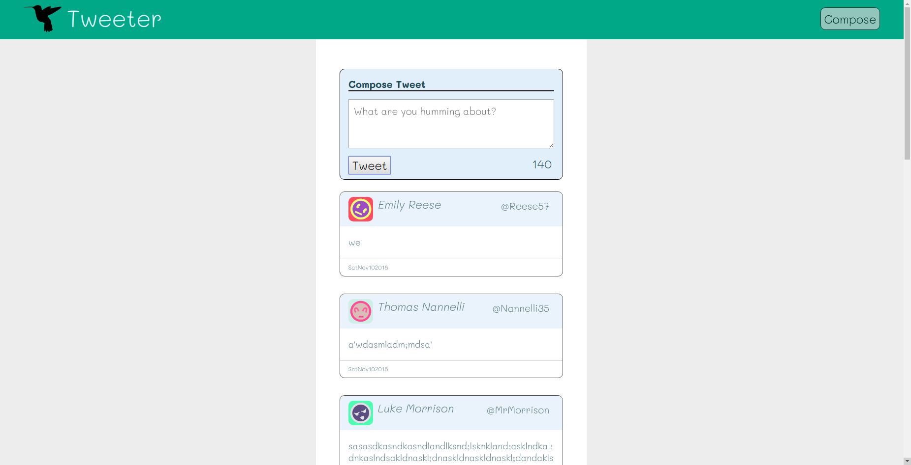
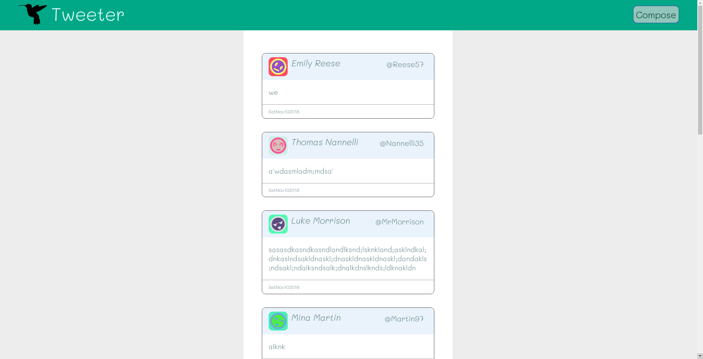
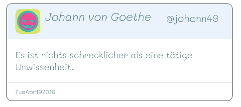

# Tweeter Project by [Ying Dong](https://github.com/dongyingname)

## This is a tiny web app that is build to have basic functionality of tweeter:
- Users can post new tweets.
- The page will dynamically generate the new tweets above the older tweets.
- Newly submitted tweets will be POST to the mongo data base through Ajax, which prevents reloading the page while the user still looks at the content.

## Dependencies
- node.js
- Express
- body-parser
- nodemon
- chance
- md5
- mongoDB
## Getting Started
- To run the web server run the following command in terminal:
```
$npm install to install all the dependencies.
```
```
$npm run local 
```
- To view the tweeter page go to http://localhost:8080/.

## Important:
- In order that the client properly access the mongoDB database the stored user data have to be separate objects which contain keys such as "_id", "user", and "content" and their values.

## Screenshots




## Author
[Ying Dong](https://github.com/dongyingname)
--Currently a student of [Lighthouse Labs Web Dev BootCamp](https://lighthouselabs.ca/web-bootcamp)
--2 Month of Coding learning exprience

## License
Free.